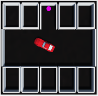
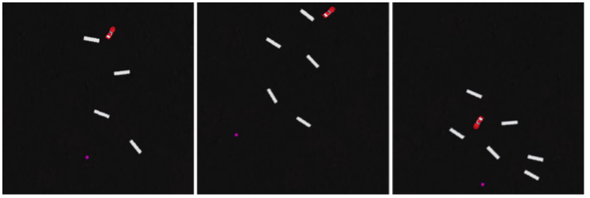

# Hybrid-A-Star for Low-Speed Maneuvers in Unity

## Overview

This Unity project showcases the application of the Hybrid-A-Star algorithm to an automotive context. The Hybrid-A-Star algorithm is employed to achieve efficient path planning for vehicles in two different scenarios. These scenes include maneuvering in narrow spaces and traversing a larger area with randomly placed obstacles.

### Scenarios   :

1. **Maneuvering in Narrow Spaces:**
   - The algorithm is applied to navigate a vehicle through tight and narrow spaces, making it suitable for urban environments, parking lots, or any scenario requiring precise maneuvering.

   

2. **Traversing a Larger Area with Random Obstacles:**
   - The algorithm is tested in a context where the vehicle needs to navigate through a larger area with obstacles randomly positioned between the start and end points. This simulates scenarios like navigating through cluttered warehouses, dynamic construction sites, or obstacle-filled off-road terrains.

   

## Hybrid-A-Star Algorithm

The Hybrid-A-Star algorithm is chosen for its capability to generate smooth and feasible paths by combining grid-based and sampling-based approaches. It utilizes a grid to discretize the space and employs Dubins paths for smooth transitions between grid points. This hybrid approach allows for efficient and optimal path planning in complex environments.

## Unity Project Structure
```plaintext
|-- Assets/
|   |-- Scenes/
|   |   |-- Garage.unity
|   |   |-- RandomObstacles.unity
|   |-- Scripts/
|   |   |-- Pathfinding/      
|   |   |   |-- Parameters.cs      
|   |   |   |-- ...
|   |   |-- Self-driving Vehicle/
|   |   |-- Simulation/
|   |   |-- Test areas/
```

- The `Scenes` directory contains Unity scene files for the narrow spaces and random obstacles scenarios.
- The `Scripts` directory contains C# scripts implementing the Hybrid-A-Star algorithm, vehicle control, and scenario management.

## Getting Started

1. Clone the repository:

   ```bash
   git clone https://github.com/your-username/hybrid-a-star-unity.git
   ```

2. **Open the Unity project in the Unity Editor.**

   Once the project is open in the Unity Editor, you can explore the project files, scenes, and scripts.

3. **Navigate to the desired scenario:**
   - Open the `NarrowSpacesScene.unity` scene for maneuvering in narrow spaces.
   - Open the `LargerAreaScene.unity` scene for traversing a larger area with random obstacles.

4. **Verify the map parameters:**

   All the map parameters are located into the static class `Parameters.cs`. You can set both the map width and each cell width. A lower value of the `cellWidth` variable translates into a more accurate path generation, but at the cost of an increased computing time. We suggest to set `mapWidth` to 21 and `cellWidth` to 0.25 for the `Garage` scene and `mapWidth` to 80 and `cellWidth` to 1 for the `RandomObstacles` scene. 
   
   This should allow to obtain success rates higher than 95% in both cases. You can increase the success rate by reducing the `cellWidth` value. It is also possible to increase the time scale of the game and the maximum number of episodes by acting on the inspector related to the `Pathfinding` GameObject.

5. **Run the Unity scene to observe the application of the Hybrid-A-Star algorithm in the specified context.**

   Results will be printed on the console. Average computing times will also be shown.

## Acknowledgments

The implementation of the Hybrid-A-Star algorithm is based on [Self Driving Vehicle](https://github.com/Habrador/Self-driving-vehicle).

<!--- 
## License

This Unity project is licensed under the [License Name] - see the [LICENSE.md](LICENSE.md) file for details.
-->
---
